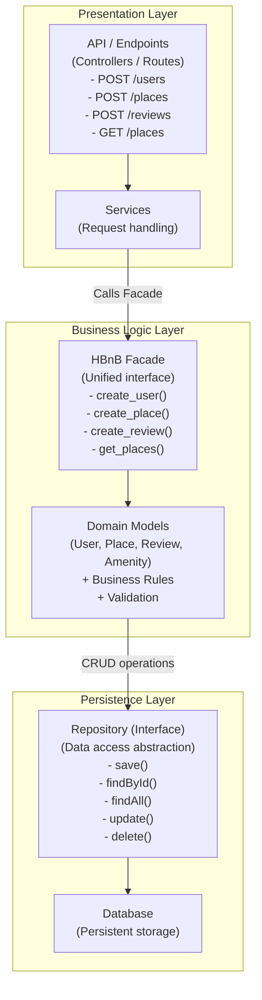
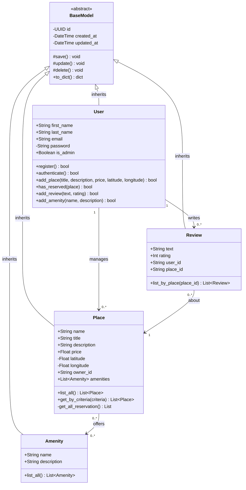
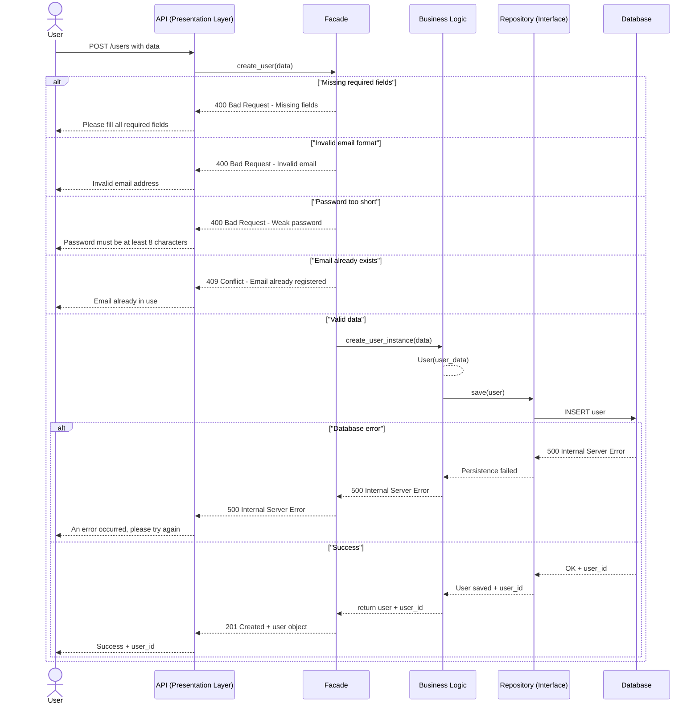
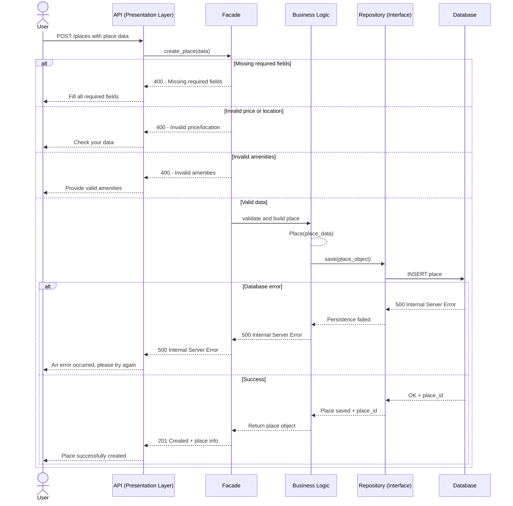
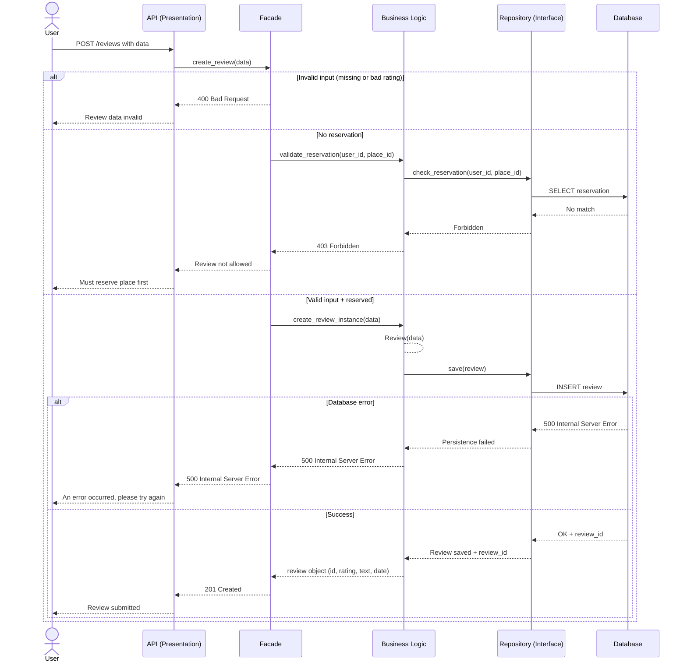
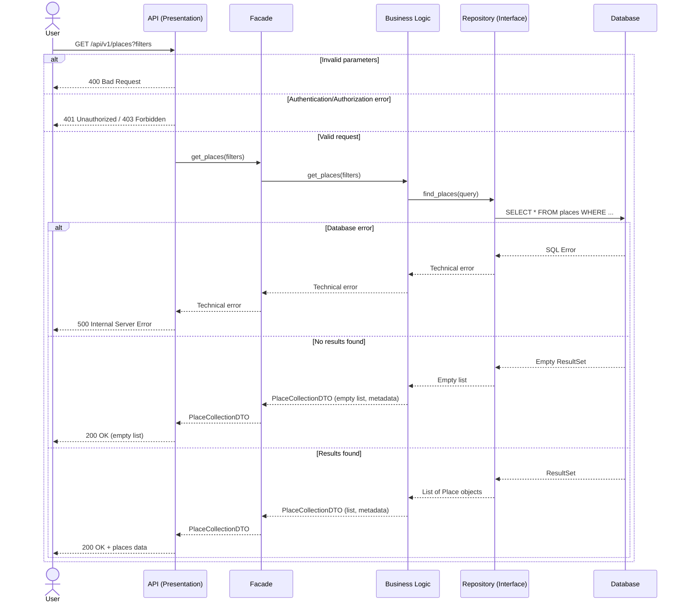

# HBnB - Technical Design Document (Part 1)

## 1. Introduction

This document serves as the comprehensive technical blueprint for the **HBnB** project (a simplified AirBnB clone). It outlines the system architecture, design decisions, and data flows that will guide the implementation phases.

The purpose of this document is to:

- Define the high-level architecture (N-tier) to ensure separation of concerns.
- Detail the Business Logic layer, including entities and their relationships.
- Visualize the communication flow between layers via API calls.

This blueprint ensures a structured approach to development, facilitating maintainability and scalability.

---

## 2. High-Level Architecture

The HBnB application is built on a **Layered Architecture** (3-tier) using the **Facade Design Pattern**. This structure ensures that each layer has a specific responsibility and interacts with others through well-defined interfaces.

### Package Diagram

### Explanatory Notes

- **Presentation Layer:** The entry point for users via the `ServiceAPI`. It handles HTTP requests and responses but contains no business logic. It delegates all processing to the Business Logic Layer.
- **Business Logic Layer & Facade Pattern:** This is the core of the application. We utilize the **Facade Pattern** (`HBnBFacade`) to provide a simplified, unified interface to the Presentation Layer. The API doesn't need to know about the complex relationships between `User`, `Place`, or `Review`; it simply calls methods on the Facade.
- **Persistence Layer:** Responsible for data storage. The Business Layer communicates with the `DatabaseRepository` to save or retrieve objects, abstracting the underlying database technology (SQL, File Storage, etc.).

---

## 3. Business Logic Layer

The detailed class diagram represents the core entities of the application and their interrelationships. All entities inherit from a common `BaseModel` to ensure consistency in ID generation and timestamping.

### Class Diagram

### Explanatory Notes

- **BaseModel:** The abstract parent class. It automatically manages the unique identifier (`UUID`) and timestamps (`created_at`, `updated_at`) for every entity, reducing code duplication.
- **User:** Represents the registered users. A user can own multiple `Places` (Host) and write multiple `Reviews` (Guest).
- **Place:** The central entity. It is linked to a `User` (owner) and can have many `Reviews`. It also has a many-to-many relationship with `Amenity` (e.g., WiFi, Pool).
- **Relationships:**
  - **Composition/Aggregation:** A Place _has_ Reviews.
  - **Association:** Users interact with Places by writing Reviews.

---

## 4. API Interaction Flow

The following sequence diagrams illustrate how the three layers interact to fulfill specific user requests.

### 4.1. User Registration

This flow demonstrates the creation of a new user, highlighting the validation logic within the Business Layer.

- **Note:** The API handles the request format, but the `HBnBFacade` enforces rules (e.g., unique email) and security (password hashing) before asking the Persistence layer to save.

### 4.2. Creating a Place

This flow shows how a logged-in user creates a listing.

- **Note:** Authentication (JWT verification) usually happens at the API level (or middleware) to protect the Business Logic. The Facade then links the new Place to the authenticated Owner.

### 4.3. Review Submission

This flow illustrates the interaction involving multiple entities (User, Place, Review).

- **Note:** The Facade acts as the orchestrator. It ensures the `Place` exists and the data is valid before allowing the persistence of the `Review`.

### 4.4. Fetching a List of Places

This flow demonstrates how users search for available properties with optional filters.

- **Note:** The Business Logic layer transforms filter parameters into database queries through the Repository interface. The system handles three scenarios: database errors (500), no results found (200 with empty list), and successful results (200 with data). The `PlaceCollectionDTO` encapsulates both the list of places and metadata (total count, pagination info, applied filters).

---

## 5. Conclusion

This technical document outlines a robust and modular architecture for HBnB. By strictly adhering to the **3-Layer Architecture** and the **Facade Pattern**, we ensure that:

1.  **Scalability:** Components can be updated or replaced (e.g., changing the database) with minimal impact on other layers.
2.  **Maintainability:** The clear separation of logic makes debugging and feature addition straightforward.
3.  **Consistency:** The centralized Business Logic layer guarantees that rules are applied uniformly across the application.

This design serves as the definitive reference for the implementation phase.
